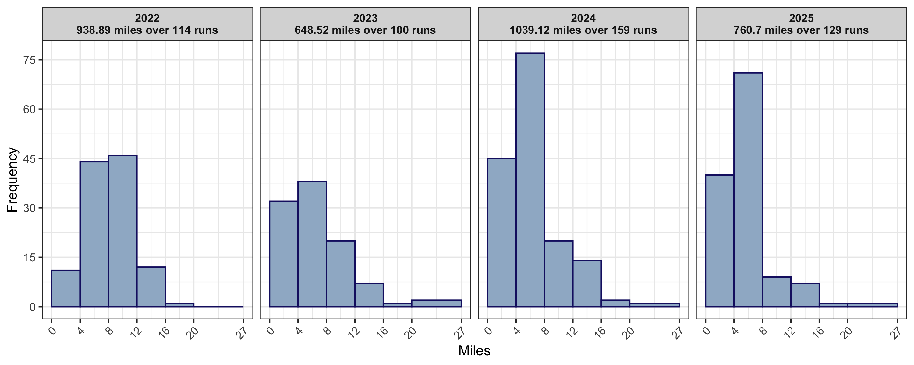

Running data
================

This repository stores `RunningData.csv`, in which I record information
about each of my runs (e.g. distance, time, average pace).

#### Distance and pace

``` r
# Read data, format dates and times
runningData <- read.csv("RunningData.csv")
runningData$Date <- as.Date(runningData$Date, format = "%m/%d/%y")
runningData$Average_Pace <- as.POSIXct(runningData$Average_Pace, format = "%M:%S")

# Plots 
library(ggplot2); library(ggpubr); library(scales); library(plotly)

plotSettings <- list(theme_minimal(), geom_line(color="gray70"), geom_point(aes(color=Treadmill_Road)), scale_color_manual(values=c(alpha("green3", 0.8), alpha("orange3", 0.8), alpha("dodgerblue3", 0.8))), theme(plot.title=element_text(hjust=0.5)), theme(legend.position="none"), scale_x_date(date_breaks="1 month", date_labels="%B-%y"), theme(axis.text.x=element_text(angle=45, vjust=1, hjust=1)))
runningData$PlotText <- paste(format(runningData$Date, format = "%B %d, %Y"), paste(runningData$Miles, "miles"), paste(format(runningData$Average_Pace, "%M:%S"), "pace"), sep = "\n")
p1 <- ggplot(runningData, aes(x = Date, y = Miles)) + geom_hline(yintercept = 13.1, linetype = "dotted", color = "mistyrose4") + geom_text(label = "13.1 (half marathon)", x = as.Date("2021-11-30"), y = 13.8, color = "mistyrose4", size = 2.5) + labs(y = "Distance (miles)", title = "How far I ran") + plotSettings + scale_y_continuous(breaks = seq(0, 30, 2))
p2 <- ggplot(runningData, aes(x = Date, y = Average_Pace)) + labs(y = "Minutes", title = "Average pace (time per mile)") + scale_y_datetime(breaks = date_breaks("1 mins"), date_labels = "%M:%S") + labs(color = "Type of run") + plotSettings +  theme(legend.position = c(0.05, 0.2), legend.background = element_rect(size = 0.1, linetype = "solid", color = "black"), legend.margin = margin(2, 3, 2, 3), legend.title = element_text(size = 9, face = "bold"), legend.text = element_text(size = 8)) + guides(color = guide_legend(override.aes = list(size = 1)))
ggarrange(p1, p2, nrow = 2)
```

<!-- -->

#### Distribution of distances by year

``` r
runningData$Year <- format(runningData$Date, "%Y")
ggplot(runningData[runningData$Year > "2021",], aes(x = Miles)) + geom_histogram(color = "black", fill = "gray", bins = 15) + facet_grid(. ~ Year) + ylab("Frequency")
```

<!-- -->

#### Summary

Total miles since 11/29/21:

``` r
sum(runningData$Miles)
```

    ## [1] 2467.15

Average distance over last ten runs:

``` r
mean(tail(runningData$Miles, 10))
```

    ## [1] 8.457
