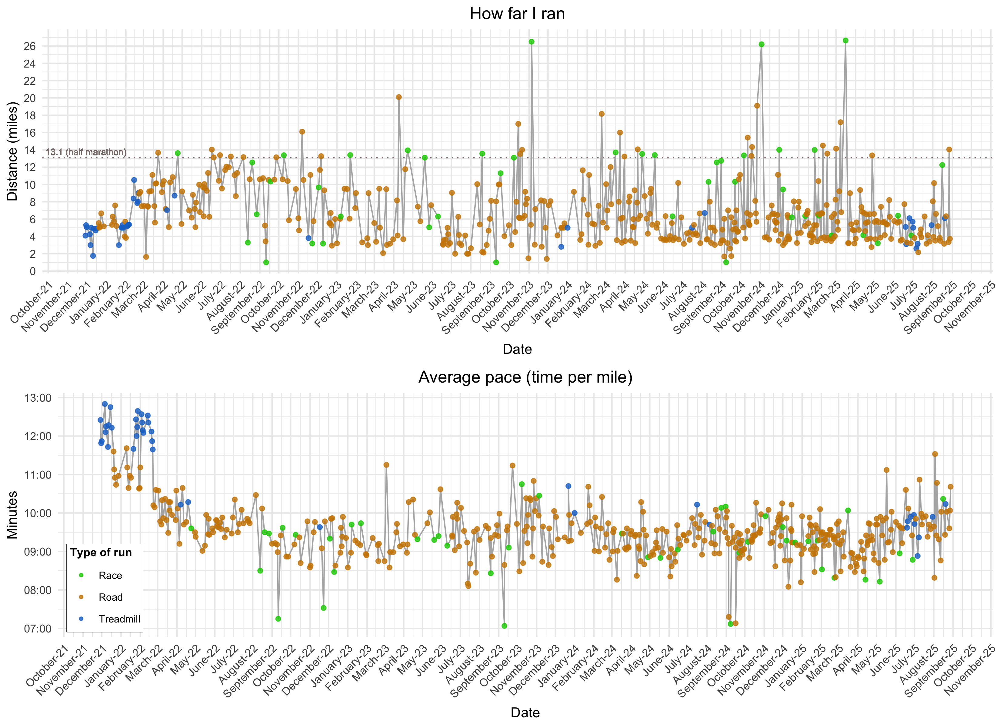

Running data
================

This repository stores `RunningData.csv`, in which I record information
about each of my runs (e.g. distance, time, average pace).

``` r
# Read data, format dates and times
runningData <- read.csv("RunningData.csv")
runningData$Date <- as.Date(runningData$Date, format="%m/%d/%y")
runningData$Average_Pace <- as.POSIXct(runningData$Average_Pace, format="%M:%S")

# Plots 
library(ggplot2); library(ggpubr); library(scales); library(ggthemr); ggthemr('dust')
plotSettings <- list(geom_line(color="gray70"), geom_point(aes(color=Treadmill_Road)), scale_color_manual(values=c(alpha("orange3", 0.8), alpha("dodgerblue3",0.8))), theme(plot.title=element_text(hjust=0.5)), theme(legend.position="none"))
p1 <- ggplot(runningData, aes(x=Date, y=Miles)) + labs(y="Distance (miles)", title="How far I ran") + plotSettings + labs(color="Where I ran") +  theme(legend.position=c(0.12, 0.85), legend.background=element_rect(size=0.1, linetype="solid", color="black"), legend.margin=margin(2,3,2,3), legend.title=element_text(size=9, face="bold"), legend.text=element_text(size=8)) + scale_y_continuous(breaks=seq(0,16,3)) + guides(color=guide_legend(override.aes=list(size=1)))
p2 <- ggplot(runningData, aes(x=Date, y=Average_Pace)) + labs(y="Minutes:seconds", title="Average pace (time per mile)") + scale_y_datetime(date_labels="%M:%S") + plotSettings
ggarrange(p1, p2, nrow=1)
```

<!-- --> Total miles since
11/29/21:

``` r
sum(runningData$Miles)
```

    ## [1] 464.66

Average distance during the last 10 runs:

``` r
mean(tail(runningData$Miles, 10))
```

    ## [1] 8.723
